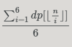
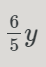

[abc 350 E](https://atcoder.jp/contests/abc350/tasks/abc350_e)    博客 ：[博客园 ](https://www.cnblogs.com/Lanly/p/18148320) dfs 期望的计算

dfs加记忆化搜索，本题的数据太大，不能开常规数组，需用用map来存储每一个状态的值，注意计算的时候浮点数和整数，在计算 cost2 的时候前半部分 由于是和概率相关的表示是否取到这个状态应该取整数，后半部分这一部分是每一个状态额外需要付的钱期望，应该取浮点数，直至递归到 0.0 或者 dp[u] != 0.0 即可。****

[abc 350 F](https://atcoder.jp/contests/abc350/tasks/abc350_f)  博客 ：[csdn](https://blog.csdn.net/Code_Shark/article/details/138036536) 递归加合理跳跃

先预处理出来成对的括号对应的位置，在计算输出的时候，dfs 需要传入 l，r，div(正序遍历 lr 还是倒序遍历 lr)，change(是否需要改变字符串中间的大小写)，没遇到完整的括号就要改变一次状态，最后合理跳过处过的区间， i  = pos[i] ，pos数组表示对应的另一半括号，这一段区间都处理过了