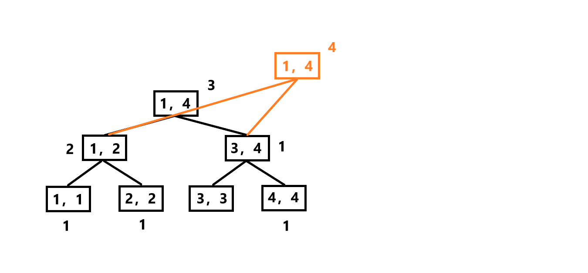
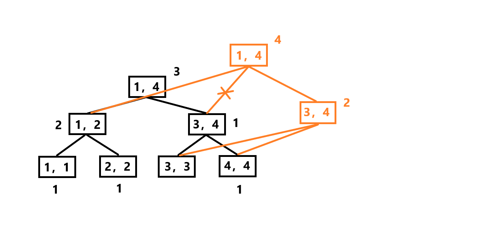
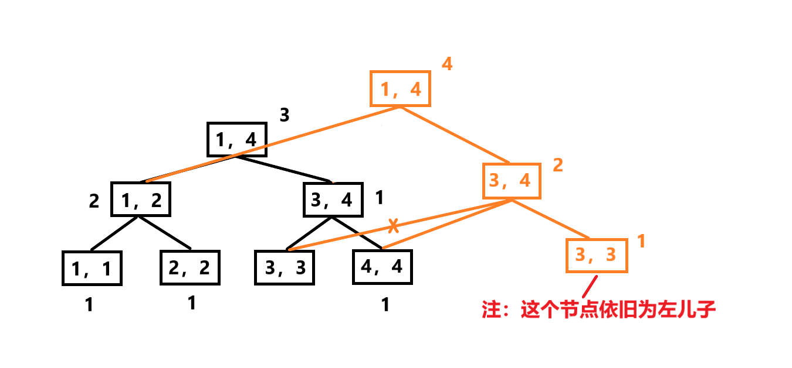

#  								线段树	


## 动态开点线段树  

更新时间 2024 5 23

用到点再开，不用不开

实现 ：

最初，只有根节点，`modify`函数时往树里插点，开两个数组记录每个节点的左右儿子的编号，递归进入左右儿子，若用新点，就开新点

```cpp
#include<bits/stdc++.h>
using namespace std;
const int N = 1e5 + 10,M = 20;
int rt,ncnt,lc[N * M],rc[N * M],sum[N * M];// lc,rc 用来记录左右儿子
void pushup(int u)
{
    sun[u] = sum[lc[u]] + sun[rc[u]];
}
void modify(int u,int l,int r,int r,int x,int val)
{
    if(!u) u = ++ ncnt;//开新点
    if(l == r)
    {
        sum[u] += val;
        return ;
    }
    int mid = l + r >> 1;
    if(x <= mid)
        modify(lc[u],l,mid,x,val);
   	if(x > mid)
       	modify(rc[u],mid + 1,r,x,val);
    pushup(u);
}
int query(int u,int l,int r,int L,int R)
{
    if(!u) return 0;//没有这个节点，直接返回0
    if(L <= l && r <= R)
        return sum[u];
   	int val = 0;
    int mid = l + r >> 1;
    if(L <= mid)
        val += ask(lc[u],l,mid,L,R);
   	if(R > mid)
        val += ask(rx[u],mid + 1,r,L,R);
   	return val;
}
int main()
{
    int n;
    cin >> n;
    pre(i,1,n)
    {
        int x;cin >> x;
        modify(rt,1,n,i,x);//没有建树操作，用到一个数据建一个节点
    }
}
```


---

## 主席树  

[主席树学习笔记 - LPF'sBlog - 博客园 (cnblogs.com)](https://www.cnblogs.com/lpf-666/p/14544420.html)

前置知识 ： 权值线段树，查询 第 k 大的数据，(全局判断，不能判断区间)

注意 第 k 大先判断 右区间， 第 k 小先判断左区间取等于

`````
//查询第 k 值，
int kth(int u,int l,int r,int k)
{
	if(l == r) 
		return l;
	int mid = l + r >> 1;
    int Ln = sum[u << 1];//左儿子中有多少数据
    int Rn = sum[u << 1 | 1];//有儿子中有多少数据
	if(k <= Rn)
		return kth(u << 1 | 1,mid + 1,r,k);
	else return kth(u << 1,l,mid,k - Rn);
}
`````

### 静态查询区间 k 大值

`````
//数组解释
root ：每次进行插入操作时都会新生成一个根节点，存储的值为节点编号，下标代表第几个根节点(历史版本)即root[i]为版本的根编号
lson : 存储的值为做儿子的节点编号，下标代表父节点的编号，如lson[3] = 5代表 3 号节点的左儿子为5点
rson ： 同理
sum ：主席树最初是一棵空树，只不过其划分的不在是区间，而是值域，sum数组存储的信息表示该值域内有多少数，其下标为节点编号
`````

- insert操作解释

例如插入节点 3 ，先建一个当前版本的新节点，指向上个版本根节点的左右子树，同时从上向下递归加数(代码是从下向上递归，本质一致)







每次插入一个数时，发生改变的最多只有 logn 个节点，其他节点相当于是在上次的基础上直接复制下来，没必要保存，只要从当前节点指向历史上某棵线段树的节点即可，这样每次新增节点之多只有 logn 个

`````
//build
int build(int l,int r)
{
	int p = ++ tot;//根节点编号
	sum[p] = 0;
	if(l == r)
		return p;
	int mid = l + r >> 1;
	ls[p] = build(l,mid);
	rs[p] = build(mid + 1,r);
	return p;
}
//insert
int modify(int last,int l,int r,int k,int v)
{
	int p = ++ tot;
	sum[p] = sum[last];ls[p] = ls[last];rs[p] = rs[last];
	//直接把上一次的节点引用过来，相当于原树扩展的基础上，现在的子树也建一个单独的线段树
	if(l == r)
	{
		sum[p] += v;//单点修改
		return p;
	}
	int mid = l + r >> 1;
	if(k <= mid)
		ls[p] = modify(ls[last],l,mid,k,v);
	else rs[p] = modify(rs[last],mid + 1,r,k,v);
	sum[p] = sum[ls[p]] + sum[rs[p]];//pushup 操作，将子树的和pushup
	return p;
}
//ask
int ask(int p,int q,int l,int r,int k)//返回的是下标，不用node
{//权值线段树 下标就是 数据！    权值线段树求整个区间第 k 值联系！
	if(l == r)//左等于右子树一个数据，k大必是本身
		return l;
	int mid = l + r >> 1;
	int lcnt = sum[ls[q]] - sum[ls[p]];//当前子树的数据量
	if(k <= lcnt) return ask(ls[p],ls[q],l,mid,k);//在当前子树求权值线段树
	else return ask(rs[p],rs[q],mid + 1,r,k - lcnt);
}
`````


本质上还是 n 棵线段树，只是用了大量节点

[Problem - 2665 (hdu.edu.cn)](https://acm.hdu.edu.cn/showproblem.php?pid=2665)

`````
#include <bits/stdc++.h>
using namespace std;
const int N = 5e5 + 10;

struct Node {
	int l, r, sum;
} tr[N * 40];

int n, q, m, idx;
int root[N], a[N], b[N];

int build(int l, int r)
{
	int p = ++idx; // 该子树的根节点 
	if (l == r) return p;
	int mid = l + r >> 1;
	tr[p].l = build(l, mid);
	tr[p].r = build(mid + 1, r);
	
	return p;
}

int insert(int pre, int l, int r, int x)
{
	int p = ++idx;
	tr[p] = tr[pre];
	//直接把上一次的节点引用过来，相当于原树扩展的基础上，现在的子树也建一个单独的线段树
	if (l == r) {
		tr[p].sum++;
		return p;
	}
	int mid = l + r >> 1;
	if (x <= mid) 
		tr[p].l = insert(tr[p].l, l, mid, x);
	else
		tr[p].r = insert(tr[p].r, mid + 1, r, x);
	tr[p].sum = tr[tr[p].l].sum + tr[tr[p].r].sum;//pushup 操作，将子树的和pushup
	return p;
}

int query(int p, int q, int l, int r, int k)//返回的是下标，不用node
{//权值线段树 下标就是 数据！    权值线段树求整个区间第 k 值联系！
	if (l == r) return r;//左等于右子树一个数据，k大必是本身
	int x = tr[tr[q].l].sum - tr[tr[p].l].sum; // 相减得到左儿子的信息 
	int mid = l + r >> 1;
	if (k <= x) // 第 K 小的数在左儿子中 
		return query(tr[p].l, tr[q].l, l, mid, k);
	else // 第 K 小的数在右儿子中 
		return query(tr[p].r, tr[q].r, mid + 1, r, k - x);
}

int main(void)
{
	scanf("%d%d", &n, &q);
	for (int i = 1; i <= n; i++) {
		scanf("%d", &a[i]);
		b[i] = a[i];
	}
	sort(b + 1, b + n + 1);
	m = unique(b + 1, b + n + 1) - b - 1;
	//最初是空树
	root[0] = build(1, m);
	for (int i = 1; i <= n; i++) {
		int t = lower_bound(b + 1, b + m + 1, a[i]) - b;
		root[i] = insert(root[i - 1], 1, m, t);
	}
	
	int l, r, k;
	while (q--) {
		scanf("%d%d%d", &l, &r, &k);
		int t = query(root[l - 1], root[r], 1, m, k);
		printf("%d\n", b[t]);
	}
	
	return 0;
}

`````


#### 例题

[ 粟粟的书架 - 洛谷](https://www.luogu.com.cn/problem/P2468)


